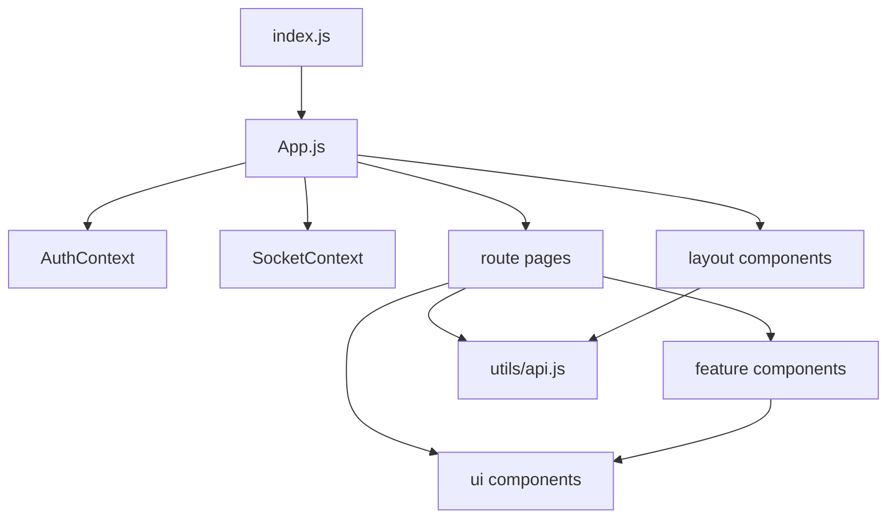
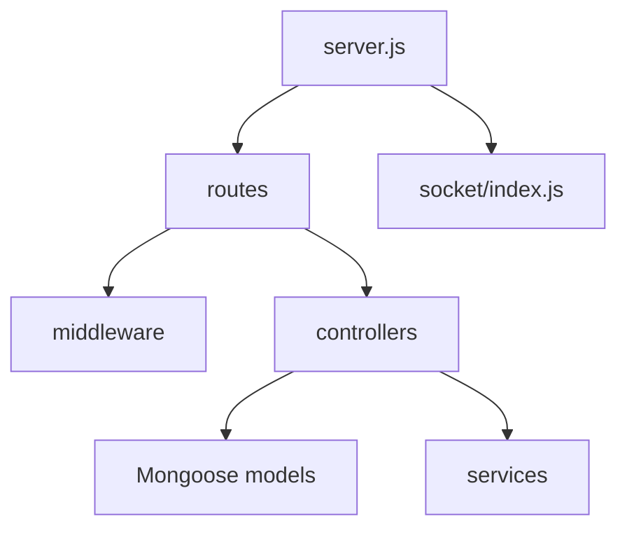

# Dependency Graph And Cleanup Notes

## Active Entry Points

- `client/src/index.js` mounts `App`.
- `client/src/App.js` defines routes and providers.
- `server/server.js` creates the Express app, Socket.IO server, routes, middleware, and MongoDB connection.

## Frontend Dependency Shape

## Backend Dependency Shape

## Removed Or Obsolete

- Nested `skillearn/` duplicate project tree.
- Old root `seed.js`.
- Old flat `client/src/index.css` and `client/src/tailwind.css` after styles moved to `client/src/styles/`.
- `.playwright-mcp/` and `test-results/` generated run artifacts.
- `README_local.md` duplicate documentation.

## Circular Dependencies

No circular source dependency was found in the active route/component structure during manual import review.

## Remaining Runtime Constraints

`npm run dev` requires ports `3000` and `5000` to be free and MongoDB to be reachable through `MONGO_URI`.
