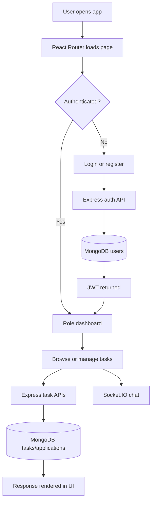

# Application Flow

## Request Flow

1. React page calls `client/src/utils/api.js`.
2. Axios sends a request to the Express route.
3. Middleware validates auth and request data.
4. Controller executes business logic.
5. Mongoose reads or writes MongoDB.
6. API responds with JSON.
7. React updates local component state and renders feedback.

## Protected Flow

`ProtectedRoute` checks `AuthContext`. If the user is missing, it redirects to login. If roles are supplied and the role does not match, it redirects to the public home page.
