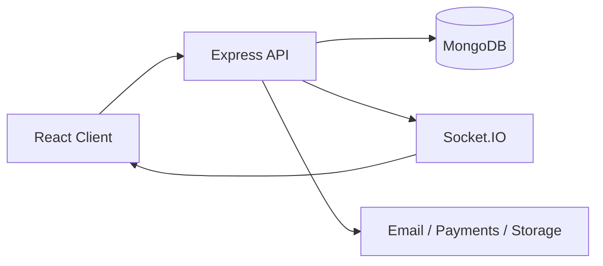

# Project Overview

## What It Does

Skill-To-Income connects students with businesses through paid micro-internship tasks. Businesses post defined tasks, students apply or accept work, submit deliverables, and build a public portfolio from completed projects.

## Target Users

- Students who want paid experience and portfolio proof.
- Businesses that need affordable short-cycle execution.
- Senior reviewers who evaluate AI/task submissions.
- Admins who moderate users, disputes, and platform quality.

## Main Features

- Authentication and role-based access control.
- Task marketplace, task detail, application, submission, and review flows.
- Student, business, senior, and admin dashboards.
- Real-time chat for task collaboration.
- Assessments, AI review, leaderboard, analytics, earnings, and profile views.

## Tech Stack

- React 18, React Router, Tailwind CSS, Axios, Recharts, Three.js/OGL.
- Node.js, Express, MongoDB, Mongoose, Passport, JWT, Socket.IO.
- Razorpay, Cloudinary, Nodemailer, and Twilio-ready integrations.

## Architecture

## Folder Structure

The active application lives in `client/` and `server/`. Frontend components are separated into `layout`, `features`, and `ui`. Backend code is separated into `routes`, `controllers`, `models`, `middleware`, `services`, and `socket`.
