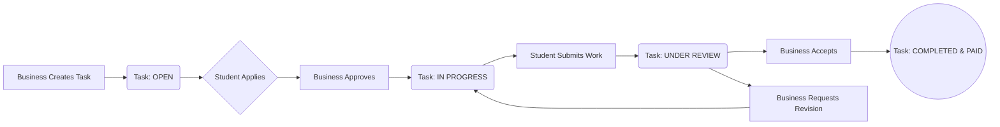

<div align="center">
  

  <h1>SkillEarn</h1>
  
  <p>
    <strong>A next-generation micro-internship platform connecting students with high-growth businesses.</strong>
  </p>

  <p>
    <a href="#demo"></a>
    
    
    
  </p>
</div>

<hr />

## 🚀 Overview

The modern entry-level job market is deeply fragmented. Students struggle to gain real-world experience, while startups and SMBs lack the budget for full-time junior hires. 

**SkillEarn** bridges this gap. It operates as a dynamic, robust task marketplace where businesses can outsource short-term, paid tasks (micro-internships), and students can build their portfolios while earning. Built with enterprise-grade architecture, strict security paradigms, and a seamless user experience, SkillEarn is designed to scale.

---

## ✨ Key Features

- **Dynamic Task Marketplace:** Intelligent feed for discovering, filtering, and applying to micro-internships.
- **Multi-Tenant Role System:** Distinct, isolated dashboards and capabilities for `Student`, `Business`, and `Company` personas.
- **Secure Authentication:** Stateless, hardened JWT-based authentication with strict HTTP-only cookie strategies and role-based access control (RBAC).
- **Financial Dashboard:** Real-time earnings tracking, payout status, and task completion metrics.
- **Task Workflow Engine:** State-machine driven task progression (Open ➔ In Progress ➔ Under Review ➔ Completed).
- **Zero-Trust Validation:** Comprehensive payload and parameter validation using `express-validator` to prevent injection and mass-assignment.

---

## 💻 Tech Stack

| Layer | Technology | Description |
| :--- | :--- | :--- |
| **Frontend** | React, TailwindCSS, Vite | Component-driven UI, responsive design, state management. |
| **Backend** | Node.js, Express.js | Scalable REST API architecture, middleware processing. |
| **Database** | MongoDB, Mongoose | NoSQL flexible schema, strict type enforcement, relationships. |
| **Security** | JWT, bcrypt, Helmet | Token-based auth, password hashing, and HTTP header hardening. |
| **Validation** | express-validator | Robust request payload validation and sanitization. |

---

## 📸 Platform Previews

<div align="center">
  <a href="#">
    
  </a>
  <a href="#">
    
  </a>
</div>
<br />
<div align="center">
  <a href="#">
    
  </a>
  <a href="#">
    
  </a>
</div>

---

## 🎥 Live Demo

**[View Live Application](#)** | **[Watch Video Overview](#)**

*(Placeholder: Add your deployed frontend link and a Loom/YouTube video walkthrough here)*

---

## 🏗️ Project Structure

A clean, modular, and service-oriented structure designed for maintainability.

```text
skillearn/
├── client/                 # React Frontend App
│   ├── src/
│   │   ├── components/     # Reusable UI components
│   │   ├── pages/          # Full page views (Dashboard, Feed, etc.)
│   │   ├── context/        # Global auth & state management
│   │   └── utils/          # API clients & helpers
├── server/                 # Node.js/Express Backend App
│   ├── src/
│   │   ├── controllers/    # Request handling & business logic
│   │   ├── models/         # Mongoose DB schemas (strict definitions)
│   │   ├── routes/         # API endpoint definitions
│   │   ├── middleware/     # Auth (JWT), Validation, Error handling
│   │   └── config/         # Environment & DB connection setup
└── package.json            # Root configuration
```

---

## ⚙️ Local Setup

Get the environment up and running locally in mere minutes.

### Prerequisites
- Node.js (v18+ recommended)
- MongoDB (Local instance or Atlas Cluster URI)

### Installation

1. **Clone the repository**
   ```bash
   git clone https://github.com/yourusername/skillearn.git
   cd skillearn
   ```

2. **Setup Backend**
   ```bash
   cd server
   npm install
   ```
   *Create a `.env` file in the `server` directory:*
   ```env
   PORT=5000
   MONGO_URI=your_mongodb_connection_string
   JWT_SECRET=your_super_secret_jwt_key
   ```
   *Start the development server:*
   ```bash
   npm run dev
   ```

3. **Setup Frontend**
   ```bash
   cd ../client
   npm install
   ```
   *Start the React application:*
   ```bash
   npm run dev
   ```

---

## 🛣️ Task Workflow Lifecycle



---

## 👥 User Roles

1. **Student (Freelancer)**
   - Browse and filter task marketplace.
   - Apply for tasks & micro-internships.
   - Submit deliverables and track earnings/payouts.

2. **Business / Company (Client)**
   - Create, edit, and manage task listings.
   - Review incoming applications and assign tasks.
   - Approve final submissions and release payments.

3. **Administrator**
   - Platform oversight, dispute resolution, and user moderation.

---

## 🛡️ Security Highlights

Built with a "Zero-Trust" mindset to ensure data integrity and platform safety:
- **Strict Schema Enforcement:** Mongoose schemas enforce data structures natively, eliminating noisy data.
- **Payload Sanitization:** Avoids mass-assignment by utilizing explicit controller-level data extraction.
- **Deep Validation:** `express-validator` guarantees endpoints only process clean, expected data, returning detailed 400 validation errors for invalid shapes.
- **Stateless Auth:** Role and identity are securely verified strictly via cryptographically signed JSON Web Tokens.

---

## 🔮 Future Roadmap

- **AI-Powered Task Matching:** NLP algorithms to auto-suggest tasks to students based on their profile skills and past success.
- **In-App Messaging Chat:** Real-time websockets (Socket.io) for continuous communication between businesses and students.
- **Dispute Resolution Center:** Automated workflows for handling task disagreements and moderation.
- **Integrated Payment Gateways:** Automated fiat and escrow payouts via Stripe Connect / Razorpay integrations.

---

<div align="center">
  <b>Built with passion by <a href="https://github.com/yourusername">Your Name/Organization</a>.</b><br>
  For professional inquiries, reach out at <a href="mailto:email@domain.com">email@domain.com</a>.
</div>
